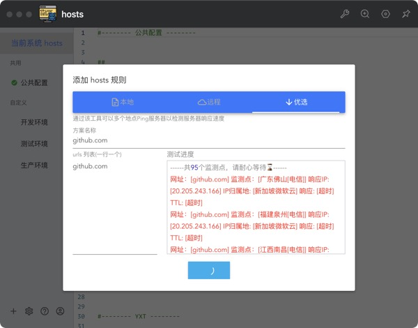

# 简介

【WIP】🎉 Store, manage and switch your hosts quickly.

hosts切换插件可以轻松创建多套hosts方案，并快速进行合并切换。

# 插件说明

公共配置：首次使用插件时，将读取系统现有 hosts 文件中的内容作为公共配置
自定义配置：用户自由创建的 hosts 片段

可自由选择一个或多个自定义方案，和公共配置合并后，一起写入系统 hosts 文件中。

# 插件帮助

如果 提示 hosts 文件不可写，请查看`C:\Windows\System32\drivers\etc\hosts`文件属性，取消文件只读属性

如果不想每次都弹出授权窗口，或360拦截窗口，可以在 hosts 文件属性中切换到「安全」标签，点击「编辑」，选择你当前的登录用户名，在权限列表中勾选「写入」，保存退出

1. 特性

- `双击`自定义方案 更新 hosts 文件
- 自定义方案 支持单选/多选
- 自定义方案支持右键菜单进行管理
- ~~支持 明亮/黑暗 两种配色~~
- ~~支持 vim 模式编辑~~

# 如何清理浏览器缓存

插件暂时无法自动清理 dns 缓存，如果 hosts 切换后解析不正确，可以新打开一个无痕浏览标签，或参考以下方法清空 dns 缓存

*. chrome浏览器

1. 地址栏中输入`chrome://net-internals/#dns`
2. 右上角下拉菜单中选择：`Clear cache` 和 `Flush sockets`

*. firefox浏览器

4. 地址栏中输入`about:config`
5. 搜索`network.dnsCacheExpirationGracePeriod`，编辑此项值为`0`

# hosts 文件位置
widnows: `C:\Windows\System32\drivers\etc\hosts`
macOS/linux: `/etc/hosts`

# 激活生效

大部分情况下是直接生效，如未生效可尝试下面的办法，刷新 DNS：

1. Windows：在 CMD 窗口输入：`ipconfig /flushdns`
2. Linux 命令：`sudo nscd restart`，如报错则须安装：`sudo apt install nscd` 或 `sudo /etc/init.d/nscd restart`
3. Mac 命令：`sudo killall -HUP mDNSResponder`

Tips： 上述方法无效可以尝试重启机器。

# TODO
- [ ] 登录同步远端数据，本地数据存储
- [x] 可添加远程源进行更新。
- [x] 添加特定网站，一键优选 ip

# 资源
https://github.com/521xueweihan/GitHub520

https://github.com/oldj/SwitchHosts

https://github.com/AaronFeng753/Smart-Hosts-Manager

https://github.com/fliu2476/gh-hosts/

https://github.com/jianboy/github-host

